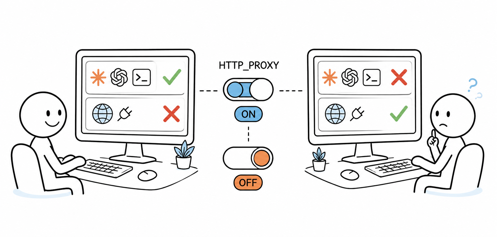

<p align="center"></p>
<h1 align="center">境启 ProxyEnv</h1>
<p align="center"><strong>Windows 应用网络环境诊断与配置助手</strong></p>
<p align="center">让“浏览器能联网，但开发工具连不上”的问题变得可见、可理解、可处理。</p>
<p align="center"><a href="README.md">English</a> · <strong>简体中文</strong></p>

<p align="center">
  
  
  <a href="https://github.com/GKNEETIEMAY/ProxyEnv/releases/latest"></a>
</p>

<p align="center">
  <a href="https://github.com/GKNEETIEMAY/ProxyEnv/releases/latest"><strong>下载 Windows 版</strong></a>
  · <a href="docs/ROADMAP.md">查看路线图</a>
  · <a href="SECURITY.md">安全说明</a>
</p>

> [!IMPORTANT]
> 当前稳定版为 **v0.1.3**，支持 Windows 10/11 x64。正在开发的 **v0.1.4** 功能不包含在当前下载包中，具体范围见[路线图](docs/ROADMAP.md)。

## ProxyEnv 是什么？

ProxyEnv 不是另一个代理软件。它是一个 Windows 应用网络环境诊断与配置助手，把分散在系统和应用启动环境中的代理状态集中展示出来：

```text
本机代理客户端
        ↓
Windows System Proxy
        ↓
TUN / 虚拟网卡状态
        ↓
代理环境变量
        ↓
目标应用启动环境
```

它帮助你识别代理未启动、端口变化、环境变量缺失或不完整、配置不一致、多客户端并存，以及应用启动环境与当前活动代理不一致等情况。

## 为什么需要 ProxyEnv？

浏览器明明可以联网，但 Git、Claude Code、Codex、npm、pip 或其他应用却连接失败？代理客户端已经启动，为什么不同软件的联网结果仍然不一样？

Windows 上的应用可能分别读取系统代理、代理环境变量、TUN 虚拟网卡或应用自身配置。一个入口可用，并不代表另一个应用会使用同一条网络路径。

<p align="center"></p>

## ProxyEnv 能帮你做什么？

- 自动发现本机代理客户端，识别实际监听端口与 HTTP、SOCKS5、Mixed 协议。
- 只读观察 Windows System Proxy 与 TUN / 虚拟网卡证据。
- 用 `Disabled`、`Partial`、`Enabled`、`Mismatch` 解释代理环境变量状态。
- 多代理并存时统一选择当前活动代理，供同步、测试、应用助手和新进程启动共同使用。
- 测试当前代理连通性，并检查目标应用可能使用的网络环境。
- 使用当前代理环境或直连环境启动新的应用实例。
- 安全同步、清除和恢复当前用户的代理环境变量。

所有修改都遵循同一流程：

```text
用户主动触发 → 明确展示结果 → 必要时可以恢复
```

自动检测和定时刷新保持只读，不会在后台静默修改系统环境。

## ProxyEnv 不做什么？

ProxyEnv **不会**：

- 提供代理节点或管理代理订阅、账号、密码和 Token。
- 转发网络流量，或充当 VPN / 代理客户端。
- 控制 TUN、系统路由、驱动或 Windows System Proxy。
- 自动修改第三方应用配置。
- 向运行中的进程注入或改写环境变量。
- 在用户没有明确操作时修改系统环境。

## 应用网络助手

应用助手与规则引擎已在当前 v0.1.3 提供；下文的保守诊断状态属于下一版 v0.1.4 已实现但未发布的内容。当前内置规则目录只有 Schema，首批已评审生产规则仍待完成。

应用助手保持一条短流程：

```text
选择应用 → 读取本机状态 → 解释可能的网络路径 → 推荐一个操作
         → 如需写文件则预览并确认 → 验证结果
```

它会读取活动本机代理、Windows 系统代理、代理环境变量、虚拟网卡证据与内置应用规则目录。选择运行中应用本身只用于确定其可执行文件，不会修改该进程；“使用代理启动”和“直连启动”都会创建带有明确子进程环境的新进程。手动代理引导另有一个明确标记为破坏性操作的重启入口：提示未保存内容风险并获得第二次确认后，后端会重新校验所选 PID 与已授权可执行文件，只关闭该进程，再启动一个不继承代理环境变量的替代进程。

应用规则是声明式数据，不是可执行 Adapter。规则只能声明精确进程名、固定的用户目录配置路径、一个已有字段、受支持的格式（`JSON`、`YAML`、`TOML` 或 `INI`）以及有类型的代理值。只有已评审且当前值正确的规则才能确认应用可用；代理环境变量已启用只表示“环境已配置，应用行为未知”。没有经过评审的规则时，ProxyEnv 不扫描未知配置文件；仅在检测到可用本机代理且环境变量未启用时，才建议使用代理环境启动新实例。

## 多代理客户端与网络观测

**Next — v0.1.4（已实现、未发布）：全局活动代理选择。**

多代理并存时，主页“当前活动代理”会先推荐一个可用客户端，用户可显式切换。环境同步、Mismatch 判断、连通性测试、应用助手、代理启动以及应用规则预览/应用统一使用此选择。自动刷新不会换选；原代理消失时保留原信息、标记不可用并提示重新选择。切换选择不会自动写环境变量，手动代理应用后也会成为全局目标。此选择在本次运行期间保持，重启 ProxyEnv 后重新推荐。

ProxyEnv 明确区分四个容易混淆的概念：

| 层级 | 含义 | ProxyEnv 的行为 |
| --- | --- | --- |
| 代理客户端 | v2rayN 等本机进程及其监听地址，例如 `127.0.0.1:10809` | 检测与探测 |
| Windows 系统代理 | 供兼容软件读取的 Windows 网络设置 | 只读 |
| 代理环境变量 | 新启动进程继承的用户变量 | 仅在用户明确操作后修改 |
| TUN / 虚拟网卡 | 可能让应用在没有代理变量时也改变网络路径的系统层通道 | 只读、基于多项证据观察 |

Windows 系统代理与 TUN 相互独立：可以只开启其中一种、同时开启或同时关闭。Windows 为系统代理提供了权威设置，但没有跨代理客户端通用的 TUN 开关，因此 ProxyEnv 只能结合虚拟网卡身份、运行状态及默认/分流默认路由进行证据判断。修改环境变量不会配置代理客户端、不会切换 Windows 系统代理、不会控制 TUN、不会让整台电脑的流量自动改道，也不会改变已经运行进程的环境。新启动的应用会继承此代理地址，已运行的应用需要重启才生效。端口正在监听只说明代理客户端进程可用，不代表 Windows 系统代理或 TUN 路由已经开启。

### 支持的代理客户端

当前可识别 Clash Verge Rev、v2rayN、FlClash、Hiddify、Clash Nyanpasu、Clash Party、Mihomo Party、NekoBox/NekoRay、Clash for Windows 与 GUI.for.Clash。所有已识别客户端均使用已注明来源的上游图标，未知客户端会回退到通用代理图标；自动识别失败时可手动填写主机、端口与协议。

图标来自官方上游仓库，来源与许可见 [`public/proxy-clients/ATTRIBUTION.md`](public/proxy-clients/ATTRIBUTION.md)。

## 环境变量管理与恢复

ProxyEnv 只修改当前用户的：

```text
HKEY_CURRENT_USER\Environment
```

不会写入 `HKLM`，通常不需要管理员权限。

| 协议 | `HTTP_PROXY` | `HTTPS_PROXY` | `ALL_PROXY` |
| --- | --- | --- | --- |
| HTTP | `http://host:port` | `http://host:port` | 删除 |
| SOCKS5 | 删除 | 删除 | `socks5://host:port` |
| Mixed | `http://host:port` | `http://host:port` | `socks5://host:port` |

默认选择 `HTTP_PROXY` 与 `HTTPS_PROXY`。`ALL_PROXY` 需要用户主动选择，因为它的回退范围更广，可能影响包搜索、局域网发现或 SOCKS 支持不完整的软件。

### 安全操作语义

```text
关闭：读取 → 保存快照 → 删除 → 广播 → 读回 → 验证
恢复：读取最近快照 → 精确恢复旧值 → 广播 → 验证
同步：验证回环代理地址 → 生成计划 → 保存快照 → 写入/删除 → 广播 → 验证
失败：恢复本次已改动的全部值 → 广播 → 再次验证恢复结果
刷新：只检测与比较，绝不写入
```

快照把修改前与已应用状态原子保存在 `%LOCALAPPDATA%\ProxyEnv\snapshots\latest.json`。若其它程序之后改过受管变量，恢复会停止且不覆盖。快照会校验大小、Schema 与变量白名单，并拒绝符号链接或 Windows reparse point；旧版 v1 快照不会用于恢复。

## 安全与隐私设计

### 安全诊断报告

**Next — v0.1.4：** 已实现并完成本地测试，不包含在 v0.1.3 下载包中；安装版 Windows 验收仍待完成。

点击标题栏的 **诊断报告**，可预览只读状态摘要并一键复制到 GitHub Issue 或反馈消息。默认跟随界面语言，也可独立选择简体中文、English、日本語或 한국어。切换语言只改变报告文字，不会重新诊断；点击 **刷新报告** 才重新收集状态。

报告包含版本信息、客户端数量与当前选择、相互独立的系统代理/环境变量/TUN 状态、有效缓存中的连通性结果，以及助手当前选中应用的诊断摘要。没有测试就显示 **未测试**。报告不包含用户名、应用/配置路径、代理地址、凭据、节点/订阅信息、配置原值或 PID；生成时不进行外网测试，不保存文件、不上传。分享前请先检查预览内容。

### 隐私边界

ProxyEnv 不是代理客户端、VPN、订阅管理器、流量转发器或 TUN 控制器。它不控制 Clash/v2rayN API、节点、订阅、代理客户端规则、Windows 系统代理、路由、驱动或系统级环境变量，也不会向运行中进程注入或改写其环境。关闭进程的唯一例外是上述手动引导中经过明确确认和身份校验的重启操作。

代理检测、协议探测、TUN 观测、应用枚举、规则预览和环境变量管理均在本机完成。ProxyEnv 不读取、不保存、不管理代理账号密码、订阅 Token、节点凭据、其它代理认证信息或流量。运行时诊断统一经过脱敏边界，移除本机路径、代理地址和进程信息；配置字段原始值按完整敏感数据处理。除非用户明确触发现有代理测试，否则不会进行外部联网测试。用户主动检查更新时会访问固定的官方 GitHub 地址；再次点击“下载并安装更新”后，才会下载清单指定且通过签名验证的安装包。详见 [`SECURITY.md`](SECURITY.md)。

## 与环境变量工具对比

下列工具解决的是相邻问题。ProxyEnv 刻意保持更窄的范围，专注代理发现、网络层解释，以及安全的新进程启动或经过评审的规则修改。

| 工具 | 推荐度 | 适合什么情况 | 主要特点 |
| --- | --- | --- | --- |
| **ProxyEnv** | ⭐⭐⭐⭐⭐ | 代理冲突与应用联网问题 | 识别活动代理端点，解释代理/系统代理/TUN 层，支持独立启动环境与可恢复的评审规则 |
| Microsoft PowerToys – Environment Variables | ⭐⭐⭐⭐⭐ | 大多数 Windows 开发者 | 微软维护、界面现代、支持 Profile、User/System 变量 |
| EnvStudio | ⭐⭐⭐⭐⭐ | PATH 很复杂、多开发环境 | 拖拽 PATH、去重、失效路径与冲突检测、快照回滚 |
| Envarly | ⭐⭐⭐⭐½ | 喜欢开源、希望通用修改更安全 | 修改前 Diff、快照/回滚、PATH 拖拽、PowerShell/Ansible 导出 |
| Rapid Environment Editor | ⭐⭐⭐⭐ | 传统 Windows 开发环境 | 成熟、PATH 树状管理、错误检测、备份、便携版 |
| envx | ⭐⭐⭐⭐ | 喜欢终端/TUI | Rust、跨平台、快照/Profile、搜索、CLI、`.env`/JSON/YAML 导入导出 |

## 安装与使用

请从 [GitHub Releases](https://github.com/GKNEETIEMAY/ProxyEnv/releases/latest) 下载最新正式版：

- `ProxyEnv_x.x.x_x64-setup.exe` — 推荐大多数用户使用。
- `ProxyEnv_x.x.x_x64_en-US.msi` — 适合受管理的 Windows 环境。
- `ProxyEnv-x.x.x-windows-x64-portable.exe` — 免安装便携版。

文件名中的 `x.x.x` 表示实际版本号。ProxyEnv 按项目策略不使用 Windows Authenticode，Windows 可能显示“未知发布者”、SmartScreen 或“Windows 已保护你的电脑”。请仅从本仓库下载，并使用 `SHA256SUMS.txt` 与 GitHub Artifact Attestation 验证文件。

### 运行要求

- Windows 10 1803 或更高版本（x64），或 Windows 11 x64
- Microsoft Edge WebView2 Runtime；受支持的较新 Windows 通常已预装

打包版本不要求用户安装 Node.js、pnpm、Rust 或 Visual Studio。

安装版可在“关于”页面主动检查并安装 Tauri 签名更新；MSI 与 Portable 包仍通过官方 Release 手动更新。

## 技术架构

```text
ProxyEnv/
├─ src/
│  ├─ app/                       # Vue 外壳与桌面编排
│  ├─ features/                  # 代理、应用助手与设置界面
│  └─ shared/                    # IPC、i18n、类型和视觉令牌
├─ src-tauri/src/
│  ├─ commands/                  # 轻量 Tauri IPC 适配器
│  ├─ desktop/                   # 托盘、单实例、原生窗口
│  ├─ environment/               # 通用 mutation、快照、广播、验证
│  ├─ features/proxy/            # 代理检测、计划、状态、同步/恢复/关闭
│  ├─ features/network_observation/ # 只读虚拟网卡证据
│  ├─ features/application_assistant/ # 应用选择、诊断、启动、声明式规则
│  └─ services/                  # 持久化应用设置
├─ public/proxy-clients/         # 运行时图标与归属说明
└─ docs/                         # 架构文档与 README 插图
```

通用 Environment Core 不包含代理客户端或代理变量知识。完整依赖规则见 [`docs/ARCHITECTURE.md`](docs/ARCHITECTURE.md)。

## 开发环境

- Node.js `20.19+` 或 `22.12+`；推荐 Node.js 22 LTS
- 通过 Corepack 使用 pnpm 10
- Rust stable MSVC 工具链
- Visual Studio Build Tools 2022，并安装 **Desktop development with C++**

这些版本是当前 Vite 7 与 Tauri 2 工具链的实际最低要求，无需追随最新 Node Current 版本。

```powershell
cd ProxyEnv
corepack enable
pnpm install
pnpm tauri dev
```

在 VS Code 中安装工作区推荐扩展，选择 `ProxyEnv: Tauri Debug`，按 `F5` 即可。

### 验证与构建

```powershell
pnpm build
cargo test --manifest-path src-tauri/Cargo.toml --locked
cargo clippy --manifest-path src-tauri/Cargo.toml --all-targets --locked -- -D warnings
pnpm tauri build
```

按照项目的开源发行策略，ProxyEnv Windows 正式版本不使用 Authenticode，因此 Windows 可能显示“未知发布者”、SmartScreen 或“Windows 已保护你的电脑”。请仅从[官方 GitHub Releases](https://github.com/GKNEETIEMAY/ProxyEnv/releases) 下载，并使用 `SHA256SUMS.txt` 和公开工作流生成的 GitHub Artifact Attestation 验证发布文件。正式构建使用冻结的 lockfile 并强制生成 Tauri Updater 签名；NSIS 安装版只接受固定 HTTPS `latest.json`，使用内置公钥验证安装包，沿用 Tauri 默认版本比较拒绝降级，以被动模式覆盖安装并在成功后重启。Updater 私钥只存在于授权的 Actions Secret 中。手动代理仅支持 `localhost`、`127.0.0.1` 或 `::1`。详见[发布安全设计](docs/release-security.md)。

## Roadmap

```yaml
Current Stable: v0.1.3
Next: v0.1.4
```

开发进度、发布范围和未来方向以 [`docs/ROADMAP.md`](docs/ROADMAP.md) 为准。Linux 与 macOS 目前只是架构方向，没有承诺发布时间；其他 Unix 变体不在计划内。

## 贡献

欢迎贡献。请先阅读 [`CONTRIBUTING.md`](CONTRIBUTING.md)，并保持依赖方向：Proxy Feature 可以依赖 Environment Core，Environment Core 不能反向依赖 Proxy Feature。

## 贡献者

- ProxyEnv 维护者与社区贡献者
- OpenAI Codex——参与实现、测试、设计与文档编写的 AI 编程助手

## 许可证

ProxyEnv 基于 [MIT License](LICENSE) 发布，第三方图标继续遵循各自上游许可证。
